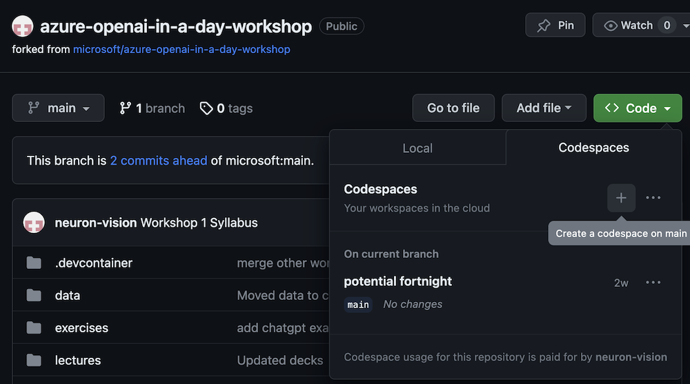

# Building our own Bot expert.

> *Dive into a hands-on workshop on language processing without LangChain! Begin with OpenAI API exercises, explore the intricacies of tokenizers, and unravel the mysteries of embeddings in N-Space. 
Our grand finale? Building your own domain expert Q&A bot. Let's innovate together!
Data Audience and prerequisite: Python programming knowledge.*

## Workshop agenda


| Activity | Description | Duration (minutes) |
|----------|-------------|-------------------:|
| Warm up: Prompt exercises | Dive into prompt basics and learn how to craft effective ones. Access: exercises/exercises.md for tasks. Opening notes. | 10 |
| Setup + Hands On | API calls to OpenAI. | 15 |
| Hands on tokenizers | Discover how data enters neural networks and the role of tokenizers. Open: exercises/preprocessing.ipynb for details. Tokenizers Review. | 5 |
| Tokenizer hands on exercise | Discussion. | 25 |
| | | 10 |
| Break | | 15 |
| Embeddings and RAG: What are embeddings and how to use them? | Beyond basic Q&A, learn to integrate your data into prompts. | 5 |
| Hands on embedding extractions and visualizing them. | | 20 |
| Embeddings vector search | | 15 |
| Break | | 15 |
| MVP: My first domain expert Q&A bot | Putting it all together, let’s build our own domain expert bot! Intro. | 5 |
| Build our own domain expert | | 70 |
| **Total Duration** | | **210** |

# Setup

1. Use this fork to work on: https://github.com/neuron-vision/azure-openai-in-a-day-workshop
2. Click Code, Codespcaes, + button: "Your workspaces in the cloud" as shown in the image:

3. It takes about 10 minutes for the space to open (Building container).
4. Once the Online VSCode opens, lets install the needed python packages.
```
pip install numpy
pip install -r requirements.txt
```
If faiss-cpu installation fails, just remove the version number so it installs the latest versions.
